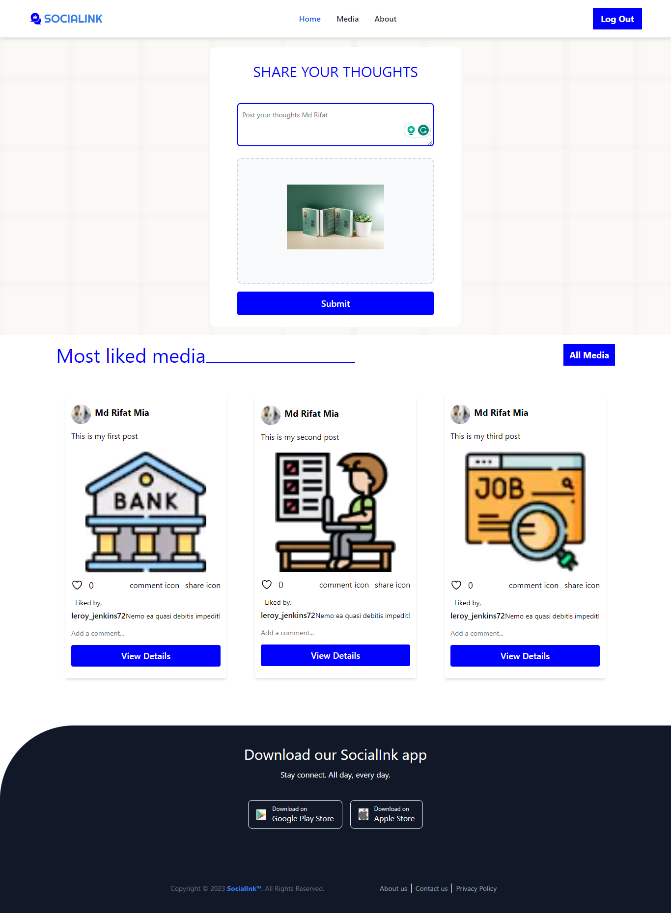
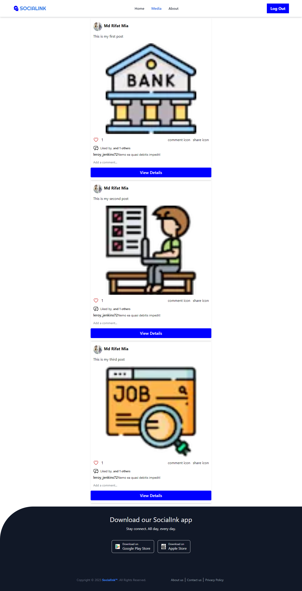

### Social-ink Frontend

### Live Link:

```
https://social-media-frontend-mu.vercel.app/
```



### Introduction

Welcome to the Social-ink Frontend! This web application serves as the user
interface for the social media platform, where users can browse and discover
various post across different genres and authors.

The primary objective of this frontend application is to provide users with a
seamless and enjoyable experience while exploring the extensive collection of
media available in the Social-ink media. It interacts with the Social-ink API to fetch
and display post information, enabling users to search for post, view detailed
descriptions, and manage their post lists effectively.


